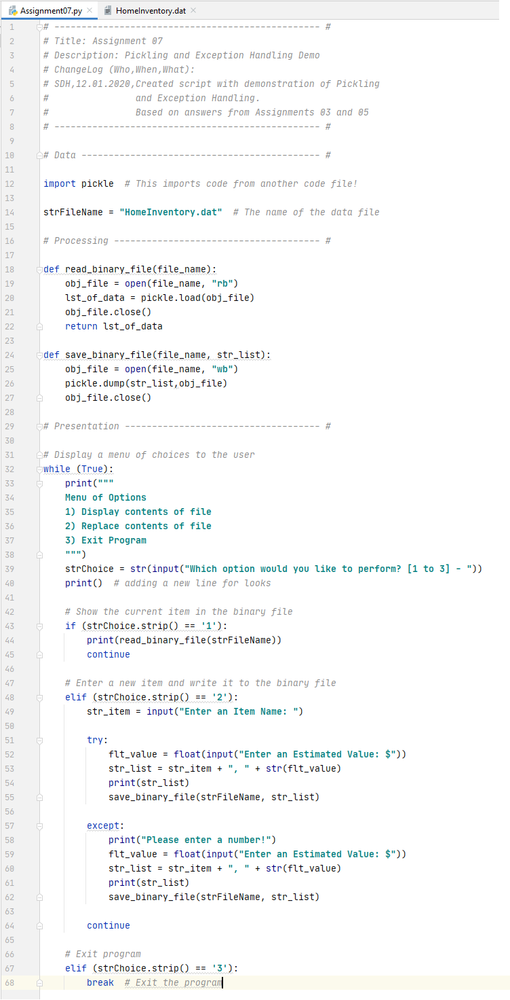
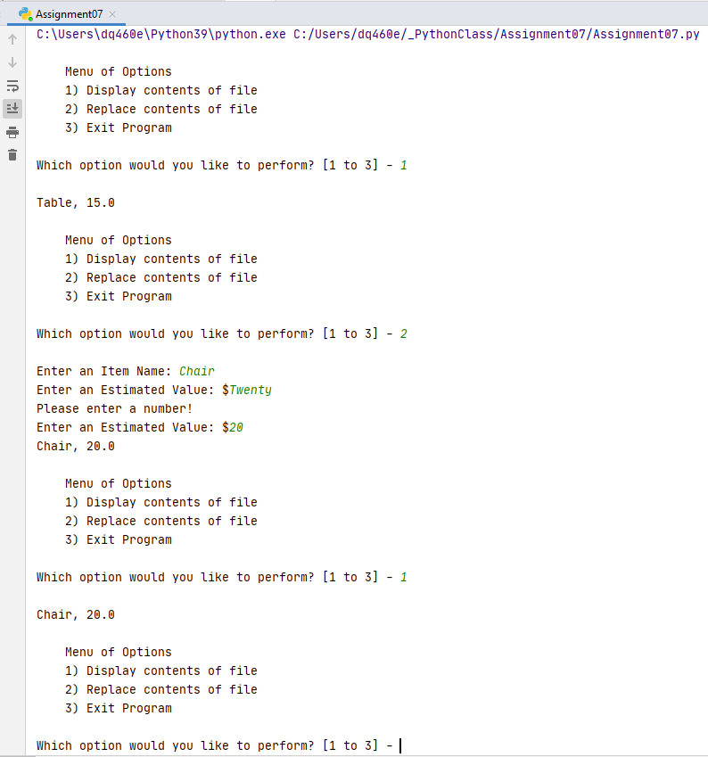
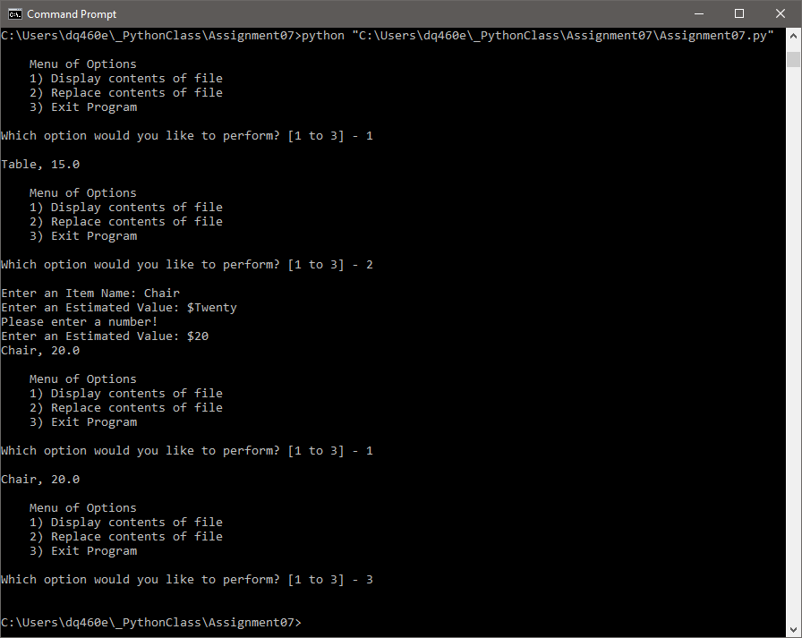
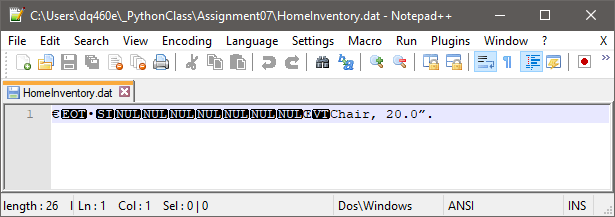

# MODULE 07: Files & Exceptions        
# ASSIGNMENT 07: Exception Handling & Pickling
 
## 1. Introduction 
This paper documents my learning from Module 7, the goal of which was to learn about creating scripts using custom functions, files and error handling.  We also learned about creating advanced GitHub web pages.   
  
I have demonstrated my learning by  
	• Being able to answer the questions provided in the Assignment  
	• Creating a script that performs this week's task - a demo of both Exception Handling and Pickling 
	• Running the script within both PyCharm and a command shell  
	• Posting my files on GitHub: https://github.com/seattlethistle/IntroToProg-Python-Mod07  
	• Adding a new GitHub web page to my repository: https://seattlethistle.github.io/IntroToProg-Python-Mod07/  
	• Posting my GitHub link to the message board  
	• Peer reviewing another student's files in GitHub and adding my comments to their post  

## 2. Background  
I watched the video "Mod07 Course Video" and followed along with the class notes "_Mod7Python ProgrammingNotes.pdf".  I also watched the Session 7 Q&A recording.  Finally I watched the "Starting Assignment 07" video.  
  
I read the seventh chapter of "Python Programming, 3rd Edition" entitled "Files and Exceptions: The Trivia Challenge Game". I'm really enjoying how the book relates each chapter to a game.  
  
There were no additional videos this week however there was a requirement to carry out independent research on both Exception Handling and Pickling.  
  
### 2a. Exception Handling  
I felt the following webpages were helpful in explaining Exception Handling.  
https://docs.python.org/3/library/exceptions.html#bltin-exceptions  
https://realpython.com/python-exceptions/  
https://en.wikibooks.org/wiki/Python_Programming/Exceptions  
https://www.programiz.com/python-programming/user-defined-exception  
  
### 2b. Pickling  
I felt the following webpages were helpful in explaining Pickling.  
https://en.wikibooks.org/wiki/Think_Python/Files#Pickling  
  
## 3. Questions  
• What are the benefits of putting built-in Python commands into functions?  
	Using built-in commands has the dual benefit of you using commands widely used and understood by other programmers and also greatly reduces the amount of code you have to write which keeps your script shorter.
  
• What are the benefits of using structured error handling?  
	Structured error handling allows you to control what error messages are seen by the user.  This allows you to make them more user friendly.
  
• What are the differences between a text file and a binary file?  
	Text files can be opened and read by any text reader whereas binary files need to be opened by a program that will correct decode their values of 1s and 0s.  Binary files are slightly smaller which is beneficial when dealing with large quantities of data.  
  
• How is the Exception class used?  
	The Exception class is used when the user encounters an error.  The programmer can insert a block of code called the Exception handler to control how the error is communicated to the user.  
  
• How do you "derive" a new class from the Exception class?  
	Custom exceptions can be defined by creating a new class which is derived, either directly or indirectly, from the built in Exception class.  
  
• When might you create a class derived from the Exception class?  
	Custom Exceptions allow you to make them more simple and concise than the built in Exceptions.  
  
• What is the Markdown language?  
	Markdown is an easy-to-read, easy-to-write syntax for formatting plain text. It also makes collaborative editing easy. 
  
• How do you use Markdown on a GitHub webpage?  
	Markdown is used by inserting non-alphabetic characters such as # or + into text in a particular way in order to change how the text will be displayed in an internet browser e.g. make it bolt, italic, larger.  
  
## 4. Assignment  
The goal of this assignment is to write a script that includes demonstrations of both Exception Handling and Pickling.  
	• Create a sub folder called Assignment07  
	• Create a new project in PyCharm within the Assignment07 folder  
	• Create the file, "Assigment07.py," within the project  
	• Add code to the script to perform the task described above  
	• Run the script in BOTH PyCharm and an OS command/shell  
	• Document the knowledge gained  

## 5. Discussion  
As the purpose of this assignment was to demonstrate understanding of 2 specific python features, I started by looking through previous examples to find code I had already written which I could modify.  I picked the answers from Assignment 03 and Assignment 05.   Assignment 03 collected user data to create a Home Inventory so I used this as my base.  I then added the menu selections from Assignment 05.  
  
I incorporated Pickling by modifying the functions to use pickle.load and pickle,dump for read and save, hence creating a binary .dat file instead of the usual csv style .txt file.  
  
I incorporated Exception Handling under menu item 2.  Since I defined the estimated value of the item to be a floating point number, I was able to insert a try/except block to catch anyone accidentally entering text.  This displays a user friendly error message and gives the user another chance to enter a number.   
  

### Figure 1: Script File in PyCharm
  
  

### Figure 2: Script run window in PyCharm
  
  

### Figure 3: Script running from a Command Shell
  
  

### Figure 4: Output File
  
  
## 7. Conclusion  
In completing Module 7 I have learned how to read and write binary files (Pickling) and also how to control how error messages are presented to the user (Exception Handling). I also learned how to transform my basic word document into a formatted web page on Git Hub.  
